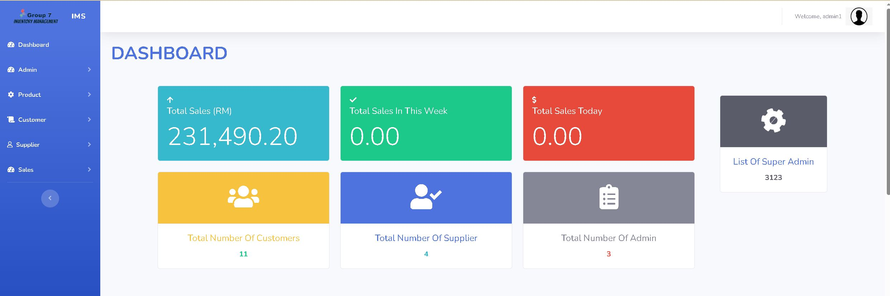
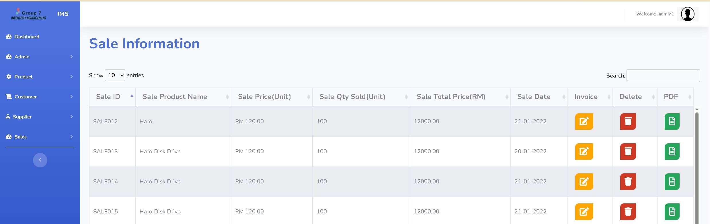
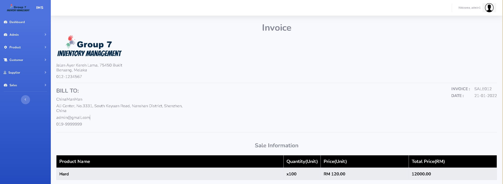

# Inventory-Management-System-using-PHP-and-SQL
It just a simplre CRUD system of Inventory Management System which use PHP and SQL

# Step
1. clone or download the file and keep in Xampp's htdocs
2. Launch Xampp
3. import the **inventory.sql** to phpadmin
4. run the Xampp server
   ```localhost/inventory[ur file name]```
5. Then loging by typing **username** and **password**:

 Administrator        | 
   ---------------------| 
   **Username** : admin1 |
   **Password** : admin1 |


## Screenshot





